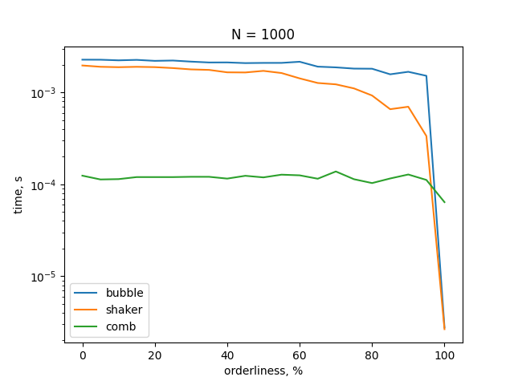

# General

This is a repository with the implementation of several algorithms and data structure in C++ language.

There are also solutions to several problems using these structures and algorithms.

# Implemented structures:

- double linked list via smart pointers

- graph

# Implemented algorithms:

- bubble sort

- shaker sort

- comb sort

- radix sort

- graph(Pre Order numbering)

- graph(Reverse Post Order numbering)

- graph(Dijkstra)

- graph(maxflow)

# Benchmarks:

